

:::: {.header-logos}
::: {.grid}
::: {.g-col-2 .d-flex .justify-content-center .align-items-center}
{width=100px}
:::
::: {.g-col-7 .d-flex .justify-content-center .align-items-center}
{width=500px}
:::
::: {.g-col-3 .d-flex .justify-content-center .align-items-center}
{width=200px}
:::
:::
::::

---

::: {.text-center}
# Example Workflow: Building an RFA Checklist
:::

## Understanding the Challenge

Research Funding Announcements (RFAs) present a common challenge for research administrators. While they contain critical information about deadlines, eligibility requirements, award details, and application components, this information is rarely organized consistently across different funding agencies.

This is where Vandalizer truly shines. Let's walk through creating a workflow that transforms varied RFA documents into standardized, actionable checklists that your team can rely on.

::: {.grid .align-items-center .mb-4}
::: {.g-col-5}
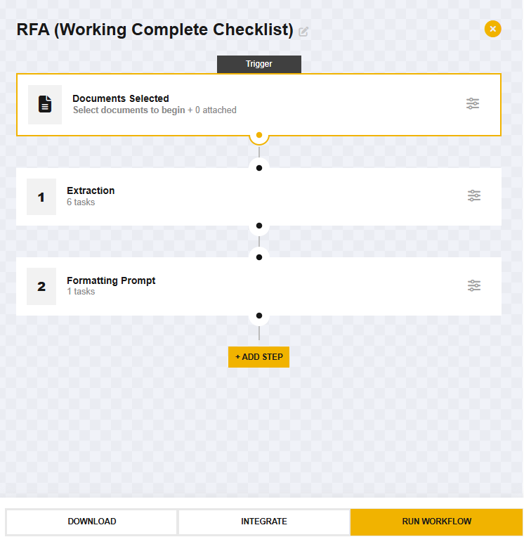{.img-fluid .border .shadow}
:::

::: {.g-col-2 .text-center}
<i class="fa-solid fa-arrow-right-long" aria-label="arrow-right-long"></i>
:::

::: {.g-col-5}
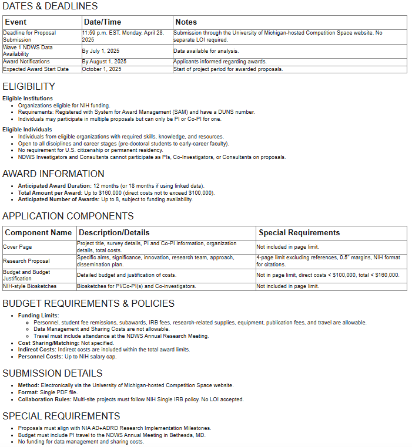{.img-fluid .border .shadow}
:::
:::

## Creating Your RFA Checklist Workflow

### Step 1: Upload Your RFA Document

Begin by uploading an RFA document to the Document Viewer window. You can simply drag and drop the file or use the 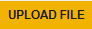{height="30px"} button.

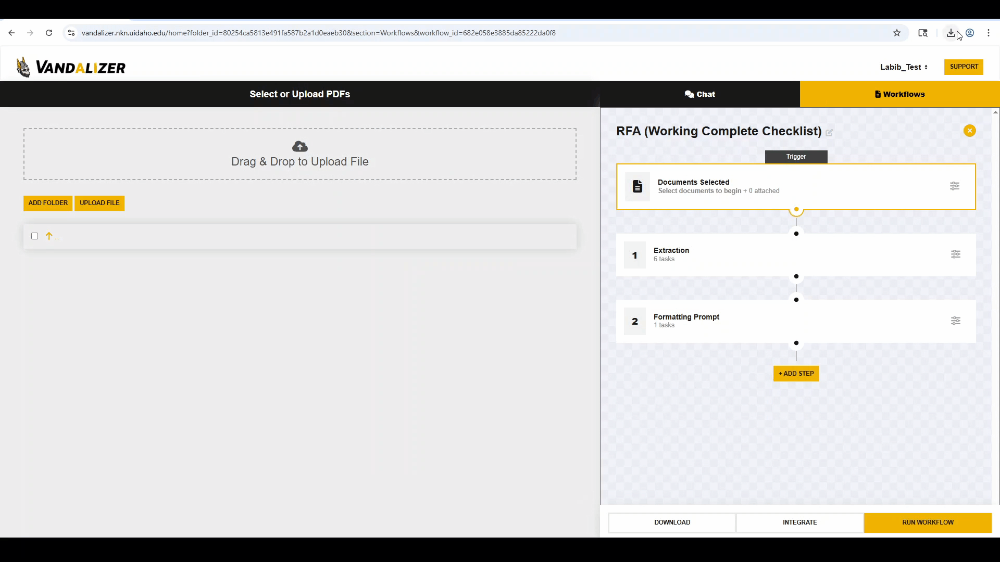{.border .shadow width="90%"}

Vandalizer will immediately begin analyzing the document with its Optical Character Recognition (OCR) process, indicated by the  spinner icon in the corner. Wait for this process to complete—when you see the  icon, Vandalizer has successfully extracted all the text and is ready for the next step.

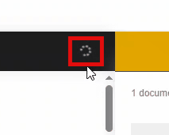{.border .shadow width="50%"}

::: {.callout-tip}
Take a moment to click the  icon and review the extracted text to ensure the document was processed correctly before proceeding.
:::

### Step 2: Design Your Tasks

For an effective RFA checklist, you'll need to create two types of tasks:

1. **Six Parallel Prompt Tasks** - These tasks will identify and pull out specific categories of information from the RFA document regardless of where it appears or how it's labeled. You'll create separate prompt tasks for:
   - Dates & Deadlines
   - Eligibility Requirements 
   - Award Information
   - Application Components
   - Budget Requirements & Policies
   - Submission Details

2. **Formatting Prompt Task** - This task will organize and consolidate all the information gathered by the six prompt tasks into a clean, standardized checklist format.

Click the 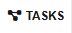{height="30px"} button on the bottom right and then click the {height="30px"} button. Select **Prompt** from the options and type in your prompt. Repeat these steps for all 6 prompt tasks and then the formatting prompt.

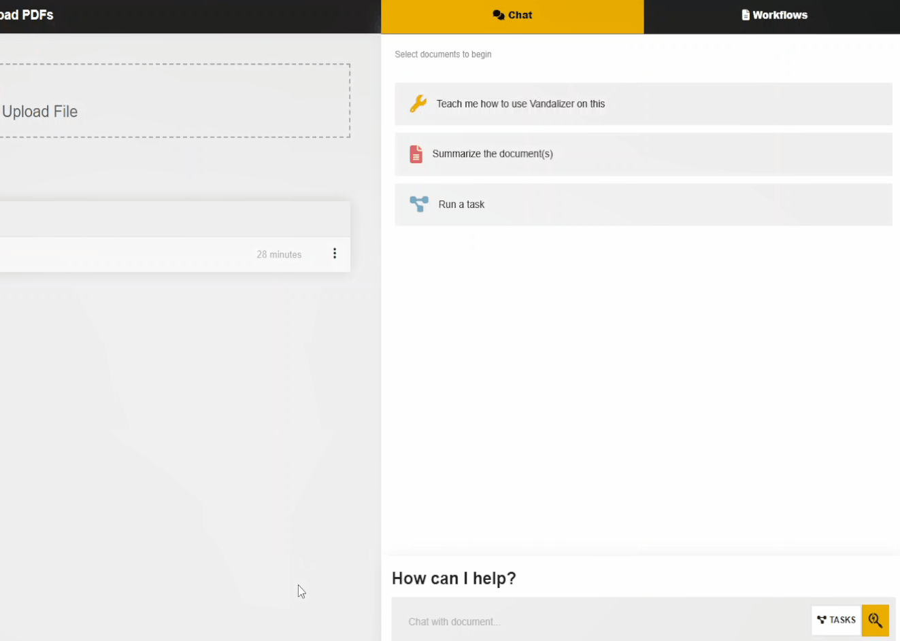{.border .shadow width="80%"}

### Step 3: Build Your Workflow

Navigate to the Workflows tab in the Toolbox window and click on the {height="30px"} button.

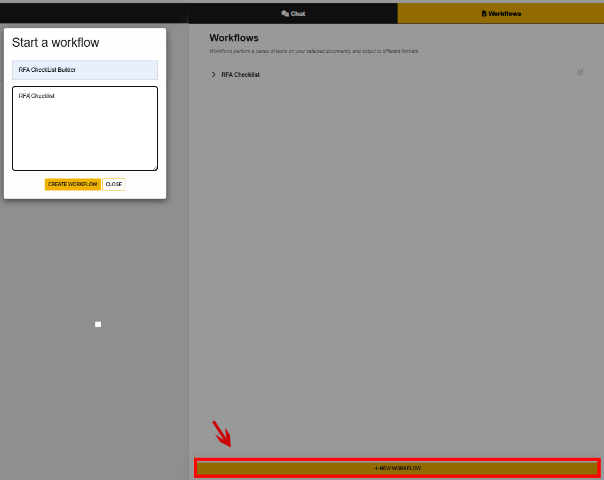{.border .shadow width="81%"}

Then click on the {height="30px"} button.

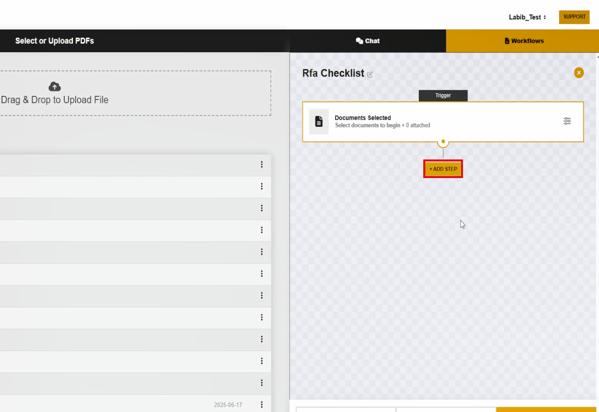{.border .shadow width="80%"}

Now click on the 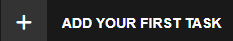{height="30px"} button, click **Prompts**, and select your previously created prompt task. Repeat these steps for the other 5 prompts.

::: {.grid .align-items-center .mb-4}
::: {.g-col-6}
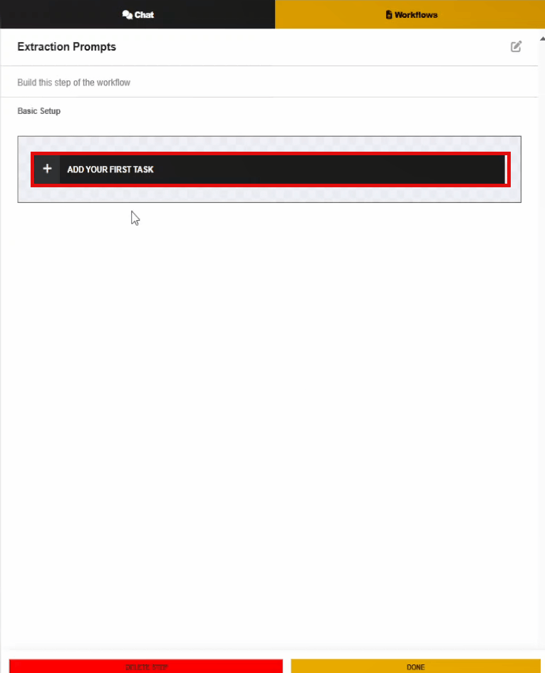{.img-fluid .border .shadow}
:::

::: {.g-col-6}
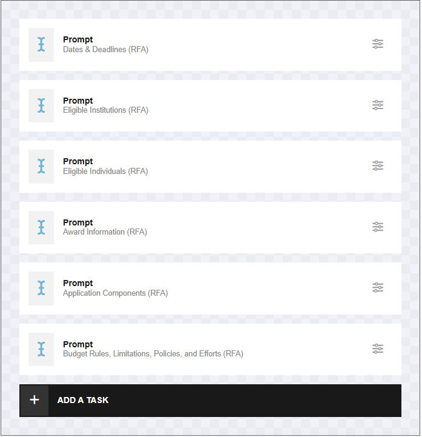{.img-fluid .border .shadow}
:::
:::

::: {.callout-note}
The parallel prompt task approach is particularly effective for RFAs because it allows each task to specialize in finding a specific type of information, even when that information is scattered throughout the document or described using different terminology across funding agencies.
:::

Now we will add a new step and do the same thing for the formatting prompt.

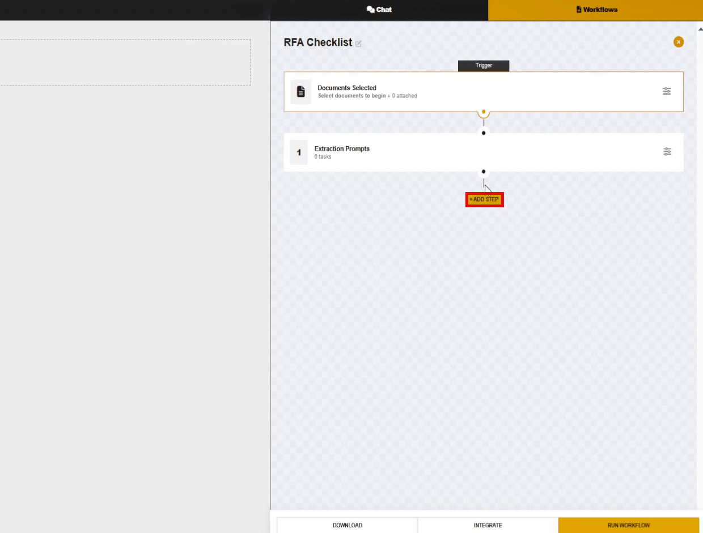{.border .shadow width="80%"}

### Step 4: Run Your Workflow

With your workflow built, you're ready to put it to work:

1. Make sure your RFA document is selected in the Document Viewer
2. Click the {height="30px"} button in the bottom right corner of the Toolbox window
3. Watch as Vandalizer processes each step, first running all six prompt tasks in parallel and then formatting the combined results into your checklist

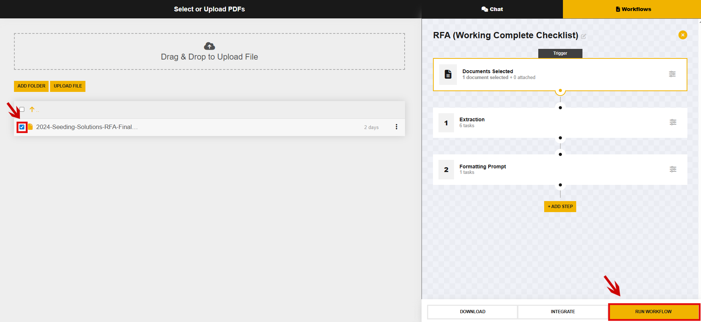{.border .shadow width="80%"}

The result? A comprehensive, well-organized checklist containing all the critical information from the RFA, presented in a consistent format regardless of how the original document was structured.

{.border .shadow width="80%"}

### Step 5: Reuse With Future RFAs

The real power of this workflow is its reusability. The next time you receive an RFA:

1. Upload the new document
2. Select your saved "RFA Checklist Builder" workflow
3. Run the workflow with a single click

::: {.text-center}
# Other Workflow Ideas
:::

  
- NSF award notice Extraction. Using an extract task important information from an award letter such as PI, dates, or total budget can be extracted. Because NSF award notices use a standard format an extraction task is a better choice than a prompt task.