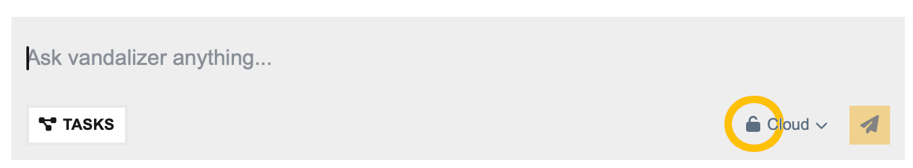

:::: {.header-logos}
::: {.grid}
::: {.g-col-2 .d-flex .justify-content-center .align-items-center}
{width=100px}
:::
::: {.g-col-7 .d-flex .justify-content-center .align-items-center}
{width=500px}
:::
::: {.g-col-3 .d-flex .justify-content-center .align-items-center}
{width=200px}
:::
:::
::::

---

::: {.text-center}
#  Security & Data Privacy
:::

## Choose Your Processing Mode

Vandalizer allows you to choose between two processing modes:

**Cloud Mode** sends data through third-party cloud services such as OpenAI and Anthropic—suitable for non-sensitive, general-purpose documents. Cloud mode leverages these scalable cloud resources for faster processing. Your documents are not sold or used to train commercial AI models; they are used only for your specific processing request.

**Private Mode** keeps data within the University of Idaho's infrastructure at Idaho National Laboratory, staying on local hardware. Use this mode for more sensitive information that you want to remain on campus.
Data in Private Mode never leaves our network and cannot be used to train external AI models. 

Private mode also runs on servers housed at the Idaho National Laboratory, which is committed to renewable and alternative energy research and development. By choosing Private mode, you're supporting sustainable computing practices and infrastructure invested in clean energy innovation. Learn more at [{width=60px}](https://inl.gov)

Look for the  dropdown selector in the Vandalizer interface to switch between modes.

::: {.text-center}
{width="60%"}
:::

---

## Upcoming: Automatic PII Detection

We're developing an automatic **PII (Personally Identifiable Information)** detector that will scan documents and enforce Private mode when sensitive information is detected, adding an extra layer of protection.

Check back here for updates on this important security feature!

